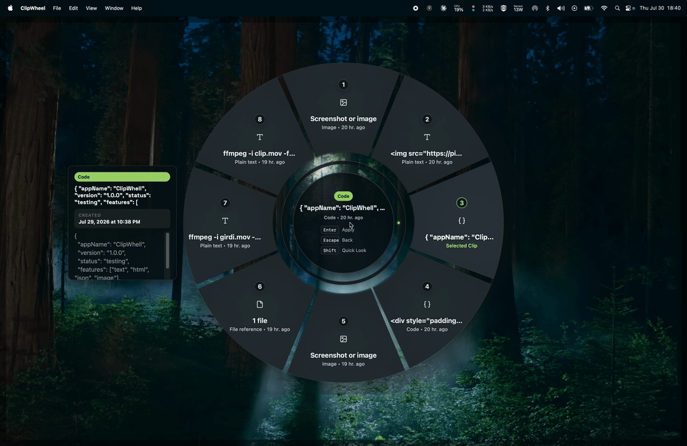
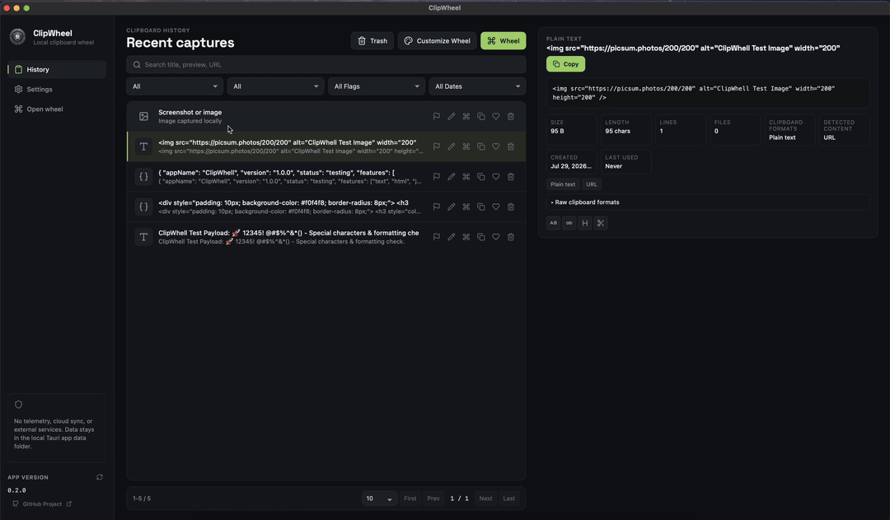
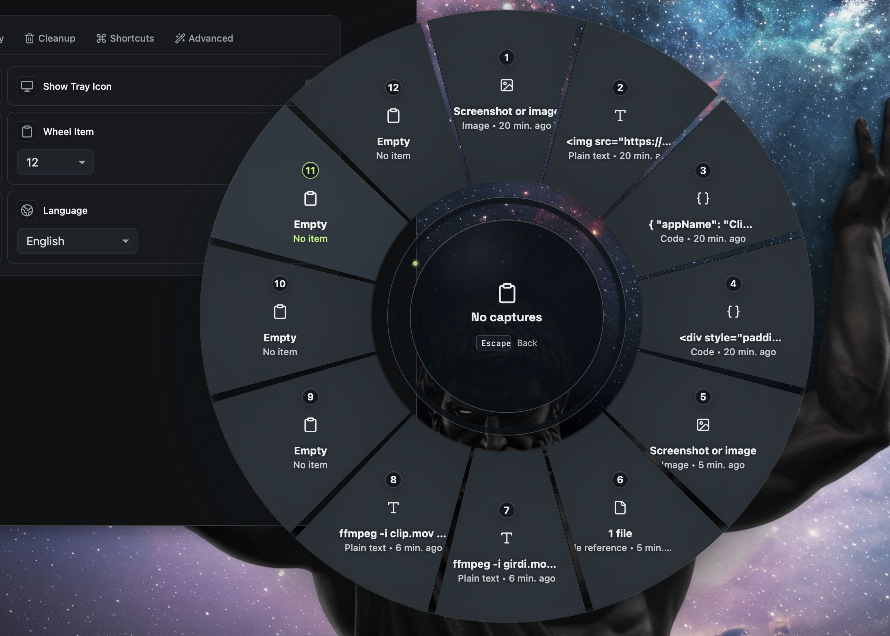
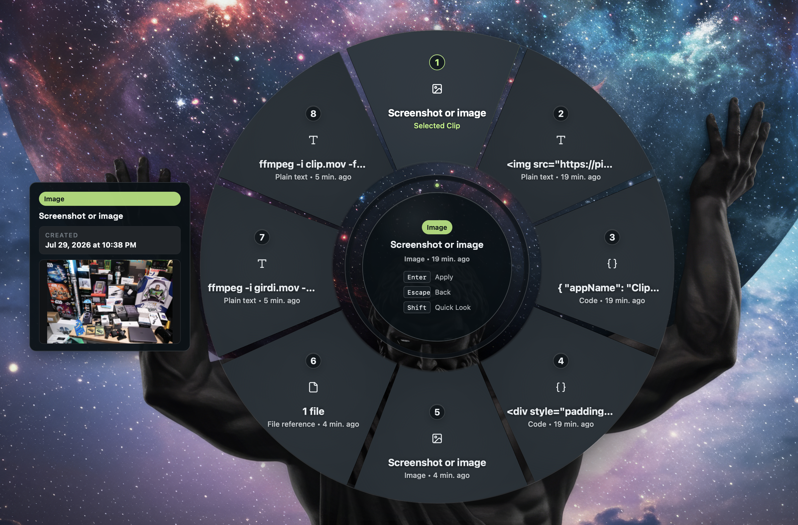
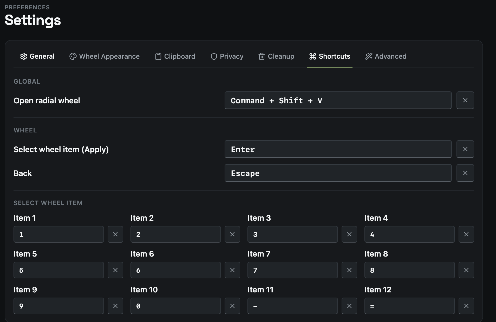
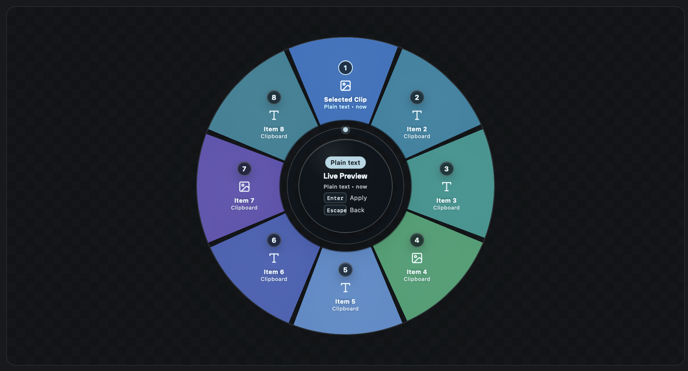
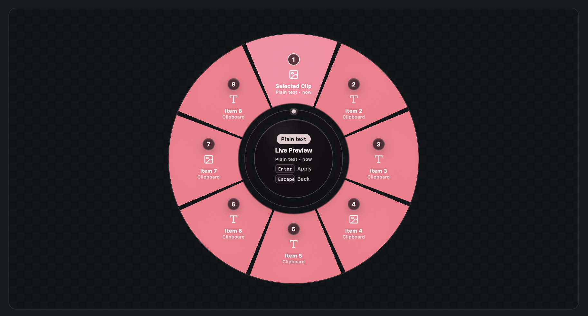
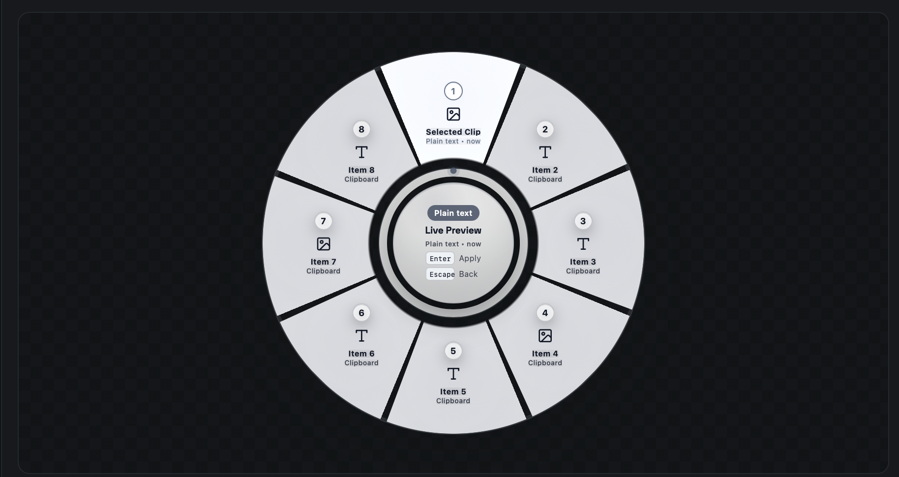
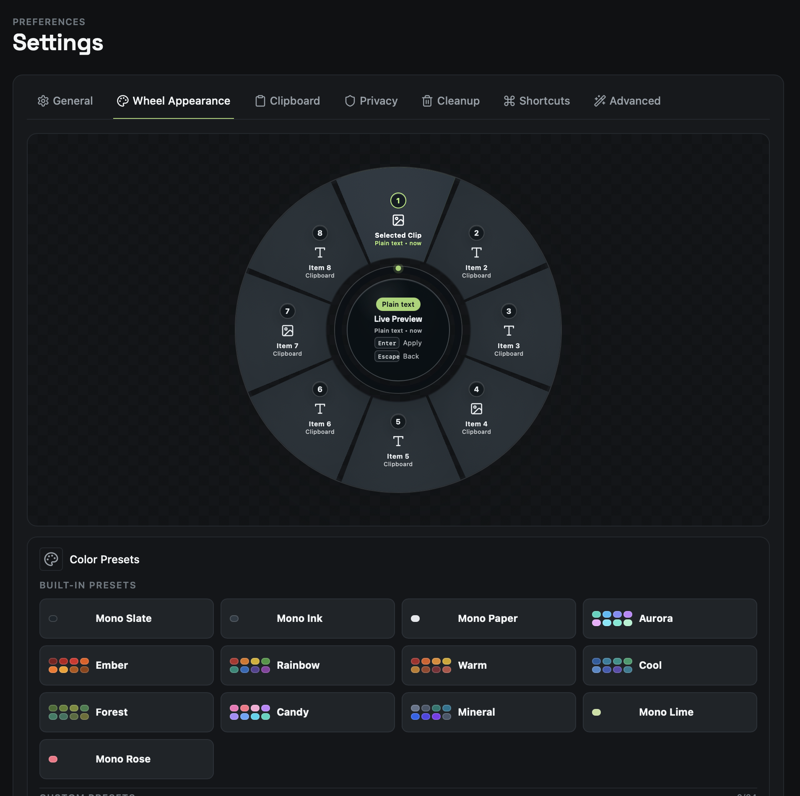
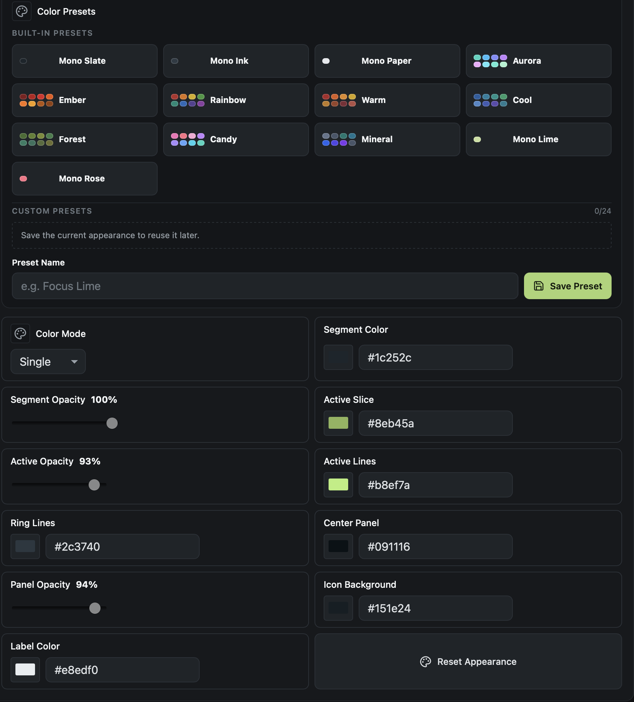

<div align="center">



# ClipWheel — 独特放射状剪贴板管理器

**停止在剪贴板历史列表中无休止地滚动。体验通过环形菜单界面访问剪贴板的最快方式。按下一个快捷键，滑动到你想要的扇区，然后粘贴。**

ClipWheel 是一款免费、开源、隐私优先的剪贴板管理器，适用于 **macOS、Windows 和 Linux** — 它具有令人惊叹的放射状滚轮（也称为环形菜单、标记菜单或 hotbox），只需一个手势即可调出你最近的 4-12 次复制内容，并且你的数据永远不会离开你的设备。

<div style="margin-bottom: 20px;">

</div>

[](https://github.com/mustafasavul/ClipWheel/releases/latest)
[](LICENSE)
[](https://tauri.app)
[](https://www.rust-lang.org)
[](https://react.dev)
[](https://www.typescriptlang.org)
[](https://vite.dev)
[](https://sqlite.org)
[](#-安装与快速开始)
[](#-隐私模型)



</div>

---

## 🎡 为什么选择滚轮而不是列表？

所有其他的剪贴板管理器都为你提供一个 **垂直列表**：打开窗口，从上到下阅读，找到正确的行，然后点击。这是一个 *搜索* 任务 —— 你的眼睛每次都在做功。

ClipWheel 将其转变为 **肌肉记忆** 任务。

- **固定的位置。** 你的最后 N 次复制内容每次都位于相同的扇区中。"倒数第二次"的复制内容永远在同一个方向 —— 右上方，而不是"大约在第 2 行的某个地方"。
- **放射状意味着等距。** 在列表中，第 8 项比第 1 项远八行。在滚轮上，每个扇区都在相同距离的滑动范围内。
- **一个手势，无需阅读。** 打开滚轮，向该扇区移动，选择。或者按下 `1`–`8`。滚轮关闭，项目回到你的剪贴板上。
- **操作前先预览。** 按住 `Shift` 键进行 **快速查看 (Quicklook)** —— 在不离开滚轮的情况下全面预览该扇区中的文本、代码或图像。
- **尺寸取决于你的记忆力，而不是你的档案库。** 4 到 12 个扇区任你选择。滚轮处理你最近复制的几个内容 —— 占据 90% 的使用场景，在不到一秒内完成。历史记录窗口处理剩下的 10%，提供搜索、筛选和预览功能。

---

## ✨ 核心特性

### 滚轮
- 通过全局快捷键在屏幕中心或鼠标光标处呼出 **放射状浮层**。
- **4–12 个可配置的扇区**，支持键盘选择 (`1`–`8`，`Enter`)，按 `Esc` 退出。
  <br/>
  <a href="docs/media/clipwhell-whell-customize-whell-items.png" target="_blank"></a>
- **Shift 键快速查看** — 对文本、代码和图像扇区进行内联预览。
  <br/>
  <a href="docs/media/clipwhell-whell-quicklook.png" target="_blank"></a>
- **键盘快捷键** — 充分利用你的肌肉记忆进行闪电般的选择。
  <br/>
  <a href="docs/media/clipwhell-whell-shortcuts.png" target="_blank"></a>
- **完全支持主题化** — 颜色预设、逐个扇区的调色板，以及自定义扇区、活动扇区、圆环、标签和面板的颜色；最多可保存 24 个自定义预设。
  <br/>
  <p align="center">
    <a href="docs/media/clipwhell-apperance-color-1.png" target="_blank"></a>
    <a href="docs/media/clipwhell-apperance-color-2.png" target="_blank"></a>
    <a href="docs/media/clipwhell-apperance-color-3.png" target="_blank"></a>
  </p>
  <p align="center">
    <a href="docs/media/clipwhell-apperance.png" target="_blank"></a>
    <a href="docs/media/clipwhell-apperance-2.png" target="_blank"></a>
  </p>

### 历史与搜索
- 完整的历史记录窗口，支持 **搜索、类型过滤、日期过滤和分页**。
- 为文本、代码、富文本、URL、图像和文件引用提供 **丰富的预览面板**。
- **每个项目的元数据**：字节大小、可读大小、文本长度、行数、文件数、创建时间和最后使用时间。
- 可对任何条目进行 **置顶、收藏和文本转换**。
- **带软删除的回收站**，支持还原和明确的永久清除。

### 捕获
- 纯文本 · 富文本 / HTML / RTF · 图像和屏幕截图 · 文件和文件夹引用 · URL · 自动检测语言的代码片段 · 终端命令。
- 生成缩略图的本地图像资产存储。
- 按类型划分的捕获开关和重复项处理。

### 隐私与控制
- **暂停捕获**、**忽略特定源应用程序** 以及 **退出时清除**。
- 系统 / 暗色 / 亮色主题，默认跟随操作系统。
- 内置 **24 种语言**，包括 RTL（阿拉伯语、波斯语）。
- 托盘图标、开机自启，以及通过 GitHub Releases 进行的签名就地更新。

---

## 🔒 隐私模型

ClipWheel 在 **设计上坚持本地优先，而不仅仅是承诺**：

- 所有内容都存储在本地的 **SQLite** 数据库和 Tauri 应用程序数据目录内的图像资产文件夹中。
- **没有遥测。没有分析。没有帐户。没有云同步。没有外部服务。**
- 该应用程序发出的唯一网络请求是检查公开的 GitHub Releases 元数据 URL 以获取更新。
- 剪贴板内容完全按复制时的样子存储 —— 没有云端分类器、没有 OCR、没有向设备外发送任何内容的屏蔽层。

你的剪贴板通常包含最敏感的数据：密码、令牌 (tokens)、私人消息。这就是它永远不会离开你的设备的原因。

---

## 📦 安装与快速开始

### macOS

```bash
brew install --cask mustafasavul/tap/clipwheel
```

或者从 [最新版本 (latest release)](https://github.com/mustafasavul/ClipWheel/releases/latest) 获取适合你芯片的 `.dmg` 文件：`ClipWheel_0.2.0_aarch64.dmg` (Apple Silicon) 或 `ClipWheel_0.2.0_x64.dmg` (Intel)。

### Windows

从 [最新版本 (latest release)](https://github.com/mustafasavul/ClipWheel/releases/latest) 下载并运行：`ClipWheel_0.2.0_x64-setup.exe` (NSIS 安装程序) 或 `ClipWheel_0.2.0_x64_en-US.msi`。

### Linux

```bash
sudo apt install ./ClipWheel_0.2.0_amd64.deb
```

```bash
chmod +x ClipWheel_0.2.0_amd64.AppImage && ./ClipWheel_0.2.0_amd64.AppImage
```

> 早期版本可能未签名或使用 ad-hoc 签名。在配置好 Apple 公证和 Windows 信任签名之前，macOS Gatekeeper 和 Windows SmartScreen 可能会发出警告。

### 最初的 30 秒

1. 启动 ClipWheel —— 它会驻留在你的系统托盘 / 菜单栏中。
2. 复制一些东西。
3. 按下 **`Cmd+Shift+V`** (macOS) 或 **`Ctrl+Shift+V`** (Windows/Linux)。
4. 向某个扇区滑动，或按下 `1`–`8`。按住 `Shift` 键可先进行预览。
5. 粘贴。

| 操作 | 快捷键 |
| --- | --- |
| 打开滚轮 | `Cmd+Shift+V` / `Ctrl+Shift+V` |
| 选择项目 | `1`–`8` 或 `Enter` |
| 快速查看预览 | 按住 `Shift` |
| 关闭滚轮 | `Esc` |

---

## 🧱 技术栈

| 层级 | 技术 |
| --- | --- |
| 桌面运行时 | Tauri v2 |
| 原生后端 | Rust — 剪贴板轮询、全局快捷键、系统托盘、OS API |
| 存储 | 通过 Diesel ORM 和迁移的 SQLite |
| 前端 | React 19, TypeScript, Vite |
| 异步状态管理 | TanStack React Query |
| UI | `lucide-react`, `highlight.js`, `sanitize-html`, 语义化 CSS token |
| 代码质量 | Vitest, ESLint, `tsc --noEmit` |
| 打包 | Tauri CLI — dmg, msi, nsis, AppImage, deb |

原生二进制文件，占用空间小，没有使用 Electron。

---

## 🛠 开发

```bash
pnpm install
pnpm dev
```

在提交 PR 之前进行验证：

```bash
pnpm lint && pnpm typecheck && pnpm version:check && pnpm test
```

构建安装程序：

```bash
pnpm tauri build
```

发布版本 (Release builds) 需要 `TAURI_SIGNING_PRIVATE_KEY`（以及可选的 `TAURI_SIGNING_PRIVATE_KEY_PASSWORD`）。CI 的冒烟测试打包使用 `pnpm package:ci`，因此合并请求 (pull requests) 构建时不需要发布签名密钥。

### 项目结构

| 路径 | 负责模块 |
| --- | --- |
| `src-tauri/src` | OS API、剪贴板、系统托盘、快捷键、SQLite、清理任务、Tauri 命令 |
| `src/shared` | 纯 TypeScript 领域类型、常量、i18n 语言包、工具函数 |
| `src/renderer/api` | 类型安全的 Tauri 命令/事件边界 (`clipwheelClient.ts`) |
| `src/renderer/data` | React Query hooks、缓存失效、API 提供者配置 |
| `src/renderer/features` | 功能界面层：`wheel`（滚轮）, `history`（历史）, `preview`（预览）, `settings`（设置） |
| `src/renderer/presentation` | 格式化和显示辅助函数 |
| `src/renderer/ui` | 可复用的 UI 基础组件 |
| `src/renderer/styles` | 语义化 Token、布局和功能 CSS |

贡献者和编码代理 (Coding agents) 的架构规则：[AGENTS.md](AGENTS.md)。工作流程：[CONTRIBUTING.md](CONTRIBUTING.md)。发布和版本控制文档：[docs/](docs)。

---

## 🗺 路线图 (Roadmap)

- 获得 Apple 公证和 Windows 信任签名的构建版本
- 可配置的全局快捷键录制
- 原生文件剪贴板恢复
- 用于本地备份的导入 / 导出功能
- 更多语法语言和预览类型

## ⚠️ 已知限制

- 自动粘贴 (Auto paste) 作为一项设置存在，但目前已被禁用且尚未模拟实现。
- 目前，文件引用只能作为文本路径恢复。
- 源应用程序检测目前是一个占位符 (placeholder) —— 跨平台的活动应用 API 各不相同。
- 已经选择 `深色 (dark)` 或 `浅色 (light)` 主题的安装版本将保留该选择；新安装版本默认使用 `系统 (system)` 主题。

---

## 🤝 参与贡献

欢迎提出 Issue 和 Pull requests —— 请参阅 [CONTRIBUTING.md](CONTRIBUTING.md) 和 [SECURITY.md](SECURITY.md)。如果 ClipWheel 节省了你的时间，给个 ⭐ 可以帮助其他人找到它。

## 📄 许可证

[MIT](LICENSE) © ClipWheel 贡献者

---

<div align="center">

<sub><b>关键词：</b> 剪贴板管理器 · 放射状菜单 · 饼状菜单 · 环形菜单 · 圆形菜单 · 滚轮菜单 · 旋转菜单 · 标记菜单 · 热盒 (hotbox) · 剪贴板历史 · macOS 剪贴板管理器 · Windows 剪贴板管理器 · Linux 剪贴板管理器 · 开源剪贴板管理器 · 隐私优先 · 离线 · Tauri · Rust · React · Ditto 替代品 · Paste 替代品 · Maccy 替代品 · CopyQ 替代品</sub>

</div>
